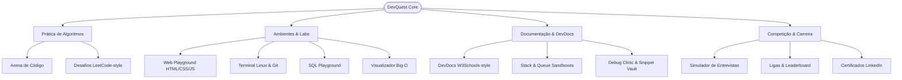

# 🌟 Visão Geral do DevQuest

> [!abstract] O que é o DevQuest?
> O **DevQuest** é uma plataforma educacional gamificada de ponta a ponta voltada para desenvolvedores de software em todos os níveis (Júnior a Sênior). Ela combina **prática de código real no navegador**, **teoria aprofundada**, **estruturas de dados animadas**, **simulações de processos seletivos reais** e **gamificação com ranking de ligas e certificados verificáveis**.

---

## 🎯 Proposta de Valor & Diferenciais

Diferente de plataformas estáticas ou excessivamente acadêmicas, o DevQuest resolve as principais dores de quem estuda programação:

| Dor Tradicional do Estudante | Como o DevQuest Soluciona |
| :--- | :--- |
| **Passividade em tutoriais de vídeo ("Tutorial Hell")** | Desafios práticos obrigatórios no navegador com feedback imediato de acerto/erro. |
| **Falta de experiência com entrevistas reais de Big Techs** | [[03.3 - Simulador de Entrevistas Técnicas (Interviews)\|Simulador de Entrevistas Técnicas]] com cronômetro real, testes ocultos e problemas reais (Nubank, Mercado Livre, Google, iFood). |
| **Dificuldade em visualizar conceitos abstratos (Pilha, Big-O)** | [[03.2 - Sandbox Interativo de Pilha (Stack LIFO)\|Stack Playground]] e [[03.8 - Visualizador de Algoritmos Big-O\|Visualizador de Algoritmos]] com animações passo a passo. |
| **Falta de incentivo diário e desmotivação** | [[03.5 - Ranking Global & Ligas de XP (Leaderboard)\|Ranking Semanal por Ligas de XP]] e ofensiva diária (*Streaks* 🔥) estilo Duolingo. |
| **Falta de comprovação no mercado** | [[03.6 - Gerador de Certificados Verificáveis\|Certificados Digitais Dinâmicos]] com integração direta para o perfil do LinkedIn. |

---

## 🚀 Pilares da Plataforma

---

## 🔗 Links Relacionados
* [[00 - Mapa do Segundo Cérebro|Voltar ao Mapa Central]]
* [[01.2 - Arquitetura de Software & Next.js 16]]
* [[03.1 - Enciclopédia DevDocs & W3Schools (Cheatsheets)]]
* [[03.3 - Simulador de Entrevistas Técnicas (Interviews)]]
