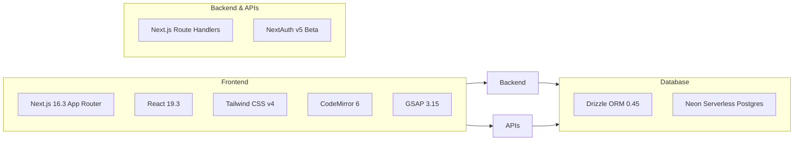

# 🏗️ Arquitetura de Software & Next.js 16

> [!info] Visão Técnica do Core
> O DevQuest foi construído com foco em **performance extrema, tipagem estrita e rendering híbrido (SSR, SSG e Client-Side Rendering)**, utilizando a versão mais recente do ecossistema React.

---

## 📦 Stack Tecnológica Principal

| Camada | Tecnologia | Justificativa de Escolha |
| :--- | :--- | :--- |
| **Framework Web** | `Next.js 16.3.4 (Turbopack)` | App Router com suporte a Server Actions, compilação subsegundo com Turbopack e geração estática ultrarrápida. |
| **Biblioteca de UI** | `React 19.3.0` | Actions assíncronas nativas, novos hooks (`useActionState`, `useOptimistic`) e hydration otimizada. |
| **Estilização** | `Tailwind CSS 4.3.3` | Nova engine CSS pura de alta performance via `@tailwindcss/postcss`, eliminando tempos de build pesados. |
| **Editor de Código** | `CodeMirror 6 (@uiw/react-codemirror)` | Mais leve e responsivo em dispositivos móveis que o Monaco Editor, com suporte a syntax highlighting para JS, HTML, CSS e SQL. |
| **Animações** | `GSAP 3.15 + @gsap/react` | Interações de alto desempenho com aceleração por GPU para transições de cartões e visualizadores. |
| **Banco de Dados** | `Neon Serverless PostgreSQL` | Banco relacional escalável a zero com driver serverless WebSocket ultrarrápido para Edge/Serverless. |
| **ORM** | `Drizzle ORM 0.45.2` | Type-safety absoluto de ponta a ponta sem overhead de runtime (zero code generation bloat). |
| **Testes** | `Vitest 5.0.0 + Testing Library` | Execução paralela de testes unitários e de integração em milissegundos. |

---

## 🔄 Divisão de Responsabilidades (RSC vs RCC)

### 1. Server Components (RSC)
* **Onde são usados**: Páginas raiz de trilhas (`/tracks/[slug]`), páginas de projetos (`/projects/[slug]`), emissor de certificados (`/certificate/[id]`).
* **Vantagens**:
  - Busca de dados direta sem expor credenciais ao cliente.
  - Redução massiva do bundle de JavaScript enviado para o navegador.
  - SEO perfeito com metadados gerados dinamicamente via `generateMetadata`.

### 2. Client Components (`"use client"`)
* **Onde são usados**:
  - `CodeEditor.tsx` e `WebPlayground.tsx`: Captura de digitação do usuário e listeners de teclado.
  - `CheatsheetViewer.tsx`: Executor de código isolado via `new Function` e sandbox de Pilha interativa.
  - `InterviewSimulator.tsx`: Cronômetro em tempo real (`setInterval`) e motor de avaliação de testes.
  - `AlgorithmVisualizer.tsx`: Controle de passos (`play`, `pause`, `speed`, índices de array).

---

## 🔗 Links Relacionados
* [[00 - Mapa do Segundo Cérebro|Voltar ao Mapa Central]]
* [[01.3 - Design System & Tokens Tailwind]]
* [[02.1 - Neon PostgreSQL & Drizzle ORM]]
* [[05.1 - Estratégia de Testes Automatizados (Vitest & Playwright)]]
