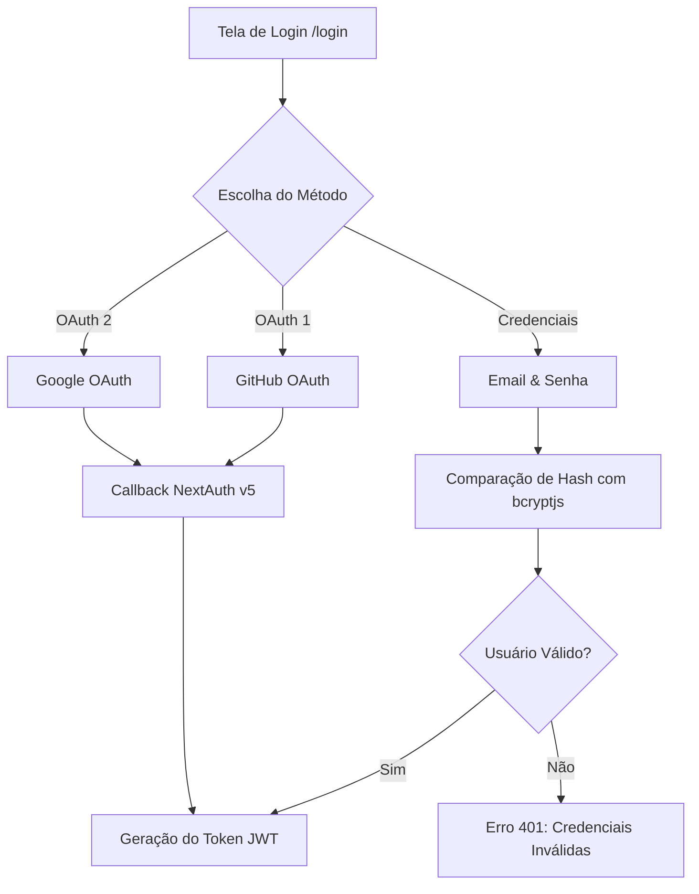

# 🔐 Autenticação & NextAuth v5 (Auth.js)

> [!abstract] Camada de Identidade e Sessão
> O sistema de autenticação do DevQuest utiliza o **NextAuth v5 (Auth.js)** com suporte unificado a **E-mail & Senha (bcryptjs)** e provedores OAuth sociais (**GitHub** e **Google**).

---

## 🛡️ Provedores Suportados (`src/auth.ts`)



### 1. Credentials (E-mail & Senha)
* **Hashing**: As senhas são criptografadas com `bcryptjs` (salt rounds = 10) antes de serem salvas na coluna `password_hash`.
* **Fallback Demo**: Possui credencial de demonstração instantânea (`demo@devquest.com` / `senha123`) para testes locais sem necessidade de configurar chaves externas.

### 2. GitHub & Google OAuth
* Integração direta via variáveis de ambiente `AUTH_GITHUB_ID`, `AUTH_GITHUB_SECRET`, `AUTH_GOOGLE_ID` e `AUTH_GOOGLE_SECRET`.

---

## ⚙️ Configuração para Vercel (`trustHost: true`)

> [!important] Evitando erros de Redirecionamento 500 na Vercel
> Em produção na Vercel, o NextAuth v5 exige a flag `trustHost: true` para confiar no cabeçalho `x-forwarded-host` emitido pelo proxy reverso da Vercel. Sem essa flag, chamadas de login e registro retornam erro 500 silencioso.

```typescript
export const { handlers, auth, signIn, signOut } = NextAuth({
  trustHost: true,
  secret: process.env.AUTH_SECRET,
  session: { strategy: "jwt" },
  // ...
});
```

---

## 🔗 Links Relacionados
* [[00 - Mapa do Segundo Cérebro|Voltar ao Mapa Central]]
* [[02.1 - Neon PostgreSQL & Drizzle ORM]]
* [[02.3 - Modelos de Dados & Schemas]]
* [[05.2 - Deploy na Vercel & Variáveis de Ambiente]]
