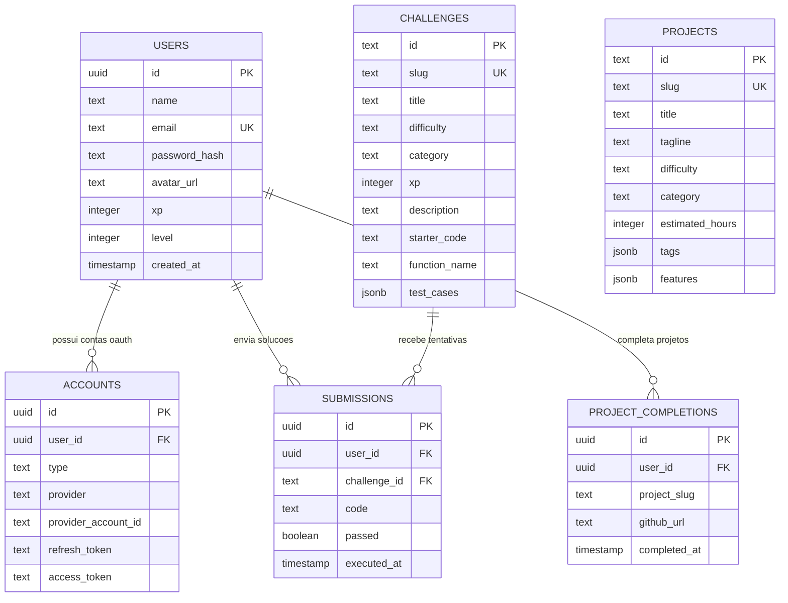

# 📊 Modelos de Dados & Schemas Drizzle

> [!abstract] Definição de Entidades do Sistema (`src/lib/db/schema.ts`)
> Todas as tabelas são modeladas de forma estrita em TypeScript utilizando o pacote `drizzle-orm/pg-core`.

---

## 🗃️ Diagrama Entidade-Relacionamento (DER)

---

## 📋 Detalhamento dos Campos Críticos

### 1. `challenges`
* `functionName`: O nome da função JavaScript exportada que o test runner invocará.
* `testCases`: JSON estruturado contendo `{ input: any[], expected: any, description: string }`.

### 2. `submissions`
* Registra o código enviado e se o usuário passou em 100% dos testes para fins de pontuação de XP e auditoria.

---

## 🔗 Links Relacionados
* [[00 - Mapa do Segundo Cérebro|Voltar ao Mapa Central]]
* [[02.1 - Neon PostgreSQL & Drizzle ORM]]
* [[03.4 - Arena de Desafios & Code Runner]]
