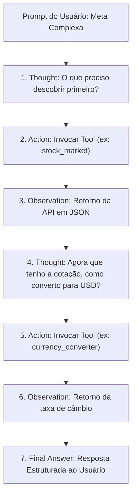

---
title: Laboratório de Agentes de IA (ReAct Simulator)
date: 2026-09-10
tags:
  - ai-agents
  - react-loop
  - tool-calling
  - function-calling
  - llm-architecture
aliases:
  - AI Agents Lab
  - Simulador ReAct
  - Laboratório de Agentes
type: module
---

# 🤖 Laboratório de Agentes de IA (ReAct Simulator)

> [!abstract] Resumo Executivo
> O **AI Agents Lab** (`/ai-lab`) é um ambiente visual e interativo projetado para desmistificar a arquitetura de **Agentes Autônomos de Inteligência Artificial**. Utilizando o padrão da indústria **ReAct** (*Reasoning + Acting*), o simulador expõe passo a passo a cadeia de raciocínio interno do modelo, a geração e validação de payloads JSON para chamadas de ferramentas (*Function Calling*) e a recepção de observações do mundo real para tomada de decisões.

---

## 🧠 A Arquitetura ReAct (Reason + Act + Observe)

Ao contrário de prompts simples que operam em disparo único (*zero-shot*), agentes autônomos resolvem problemas de múltiplos passos iterando em um loop:

---

## 🛠️ Catálogo de Ferramentas & JSON Schemas

O laboratório disponibiliza um inspetor de ferramentas onde o desenvolvedor aprende a estruturar parâmetros usando padrões de esquema da OpenAI, Google Gemini e Anthropic:

1. `web_search(query: string)`:
   - Coleta artigos técnicos e documentações recentes na web.
2. `stock_market(symbol: string)`:
   - Consulta em tempo real preços, moedas e variações percentuais na B3 e Nasdaq.
3. `currency_converter(amount: number, from: string, to: string)`:
   - Converte valores cambiais com taxas atualizadas.
4. `database_sql(query: string)`:
   - Executa consultas estruturadas somente-leitura em tabelas relacionais do Neon Postgres.
5. `send_notification(channel: string, recipient: string, message: string)`:
   - Dispara emails ou alertas para Slack/Discord.

---

## 🏗️ Implementação Técnica no DevQuest

* **Localização do Código**:
  * Engine e Ferramentas: `src/lib/ai/agentSimulator.ts`
  * Interface Gráfica Reativa: `src/components/ai-lab/AgentSimulatorView.tsx`
  * Rota Next.js: `src/app/ai-lab/page.tsx`
  * Testes Unitários: `src/__tests__/ai-lab.test.ts`

---

## 🧪 Testes Automatizados
O arquivo `src/__tests__/ai-lab.test.ts` valida:
* Especificação e obrigatoriedade de parâmetros nos schemas das ferramentas.
* Execução do loop ReAct com garantia de emissão sequencial de `thought`, `tool_call`, `observation` e `final_answer`.
* Resolução autônoma de múltiplos passos para cálculos financeiros e auditoria de banco.

---

## 🔗 Links e Notas Relacionadas
* [[04.3 - Trilha de Engenharia de IA & Agentes Autônomos|Trilha de IA & Agentes]]: O currículo teórico e prático completo.
* [[04.2 - Projetos Práticos Guiados|Projeto OmniAgent]]: Construção de um agente em produção com busca vetorial no Neon Postgres.
* [[03.14 - Mentor de Código com IA (DevBot AI)|DevBot AI]]: Assistente socrático da plataforma.