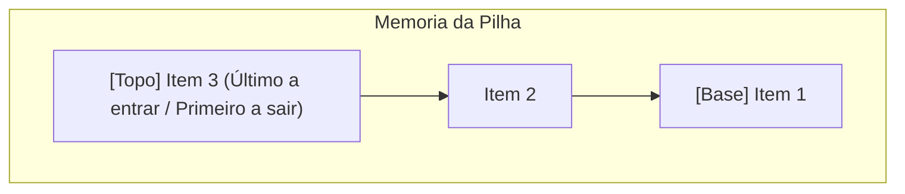

# 🥞 Sandbox Interativo de Pilha (Stack LIFO)

> [!abstract] O que é uma Pilha?
> A **Pilha (Stack)** é uma estrutura de dados linear que segue o princípio **LIFO (Last-In, First-Out)**: o último elemento inserido é obrigatoriamente o primeiro a ser removido. É o modelo fundamental por trás da **Call Stack** do JavaScript, do histórico de "Voltar" do navegador e das operações de Desfazer (`Ctrl + Z`).

---

## 🕹️ O Widget Interativo no DevQuest

Localizado na página `/cheatsheets`, o sandbox visual permite ao estudante interagir diretamente com a memória:



### Operações Suportadas:
1. **`push(valor)`**:
   - Adiciona um novo bloco no topo da pilha.
   - Complexidade: $O(1)$.
   - Alerta visual caso atinja a simulação de *Stack Overflow* (7 itens).
2. **`pop()`**:
   - Remove o elemento do topo e atualiza o ponteiro.
   - Complexidade: $O(1)$.
   - Proteção contra *Stack Underflow* (pilha já vazia).
3. **`peek()` / `top()`**:
   - Ilumina o bloco do topo em dourado sem removê-lo da memória.
   - Complexidade: $O(1)$.
4. **`isEmpty()` & `size()`**:
   - Indicadores em tempo real na barra de ferramentas.

---

## 💻 Implementação Canônica em TypeScript

```typescript
export class Stack<T> {
  private items: T[] = [];

  push(element: T): void {
    this.items.push(element);
  }

  pop(): T | undefined {
    if (this.isEmpty()) return undefined;
    return this.items.pop();
  }

  peek(): T | undefined {
    return this.items[this.items.length - 1];
  }

  isEmpty(): boolean {
    return this.items.length === 0;
  }

  size(): number {
    return this.items.length;
  }

  clear(): void {
    this.items = [];
  }
}
```

---

## 🏆 Problema de Entrevista Clássico: Valid Parentheses

Um dos problemas mais cobrados em entrevistas técnicas de FAANG:
```javascript
function isValidParentheses(s) {
  const stack = [];
  const map = { ')': '(', '}': '{', ']': '[' };

  for (const char of s) {
    if (['(', '{', '['].includes(char)) {
      stack.push(char);
    } else if (map[char]) {
      if (stack.pop() !== map[char]) return false;
    }
  }

  return stack.length === 0;
}
```

---

## 🔗 Links Relacionados
* [[00 - Mapa do Segundo Cérebro|Voltar ao Mapa Central]]
* [[03.1 - Enciclopédia DevDocs & W3Schools (Cheatsheets)]]
* [[03.3 - Simulador de Entrevistas Técnicas (Interviews)]]
* [[03.8 - Visualizador de Algoritmos Big-O]]
