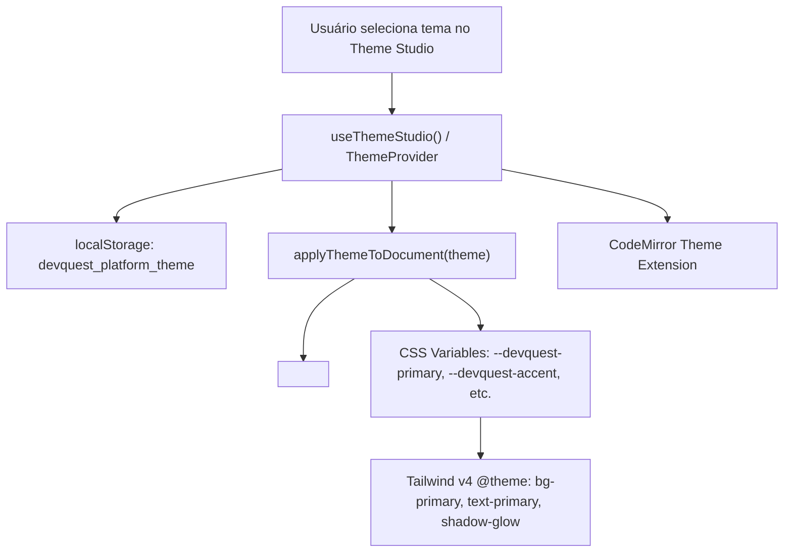

# 🌌 Theme Studio & Sistema Multi-Tema Neon

> [!abstract] Customização Visual Dinâmica
> O **Theme Studio** permite ao usuário personalizar a identidade visual do DevQuest Pro em tempo real através de 6 paletas Dark Cyberpunk homologadas, sincronizando variáveis CSS nativas do Tailwind CSS v4 com a sintaxe do CodeMirror 6.

---

## 🎨 Paletas Disponíveis

| ID | Nome | Cores Principais | Estilo CodeMirror | Destaque |
| :--- | :--- | :--- | :--- | :--- |
| `tokyo-night` | **Tokyo Night** | Cyan (`#06B6D4`) + Roxo (`#8B5CF6`) | `tokyo-night` | Padrão Oficial do DevQuest |
| `matrix` | **Matrix Hacker** | Verde Esmeralda (`#10B981`) + Limão (`#84CC16`) | `monokai-pro` | Terminal & Código Hacker |
| `cyberpunk` | **Cyberpunk 2077** | Rosa Neon (`#F43F5E`) + Amarelo Elétrico (`#EAB308`) | `synthwave-84` | Alto Contraste & Alta Voltagem |
| `dracula` | **Dracula Gothic** | Violeta (`#A855F7`) + Rosa Pastel (`#EC4899`) | `dracula` | Elegância Gótica & Conforto |
| `synthwave` | **Synthwave '84** | Fúcsia (`#D946EF`) + Laranja Sunset (`#F97316`) | `synthwave-84` | Estética Retrô Anos 80 |
| `nordic` | **Nordic Frost** | Azul Polar (`#38BDF8`) + Ciano Ártico (`#14B8A6`) | `github-dark` | Clareza Glacial & Foco |

---

## ⚙️ Arquitetura Técnica



### 1. Injeção Dinâmica de Variáveis CSS (`src/lib/theme/platformThemes.ts`)
As variáveis são injetadas diretamente em `document.documentElement`:
```typescript
root.style.setProperty("--devquest-primary", theme.colors.primary);
root.style.setProperty("--devquest-accent", theme.colors.accent);
root.style.setProperty("--devquest-bg", theme.colors.background);
root.style.setProperty("--devquest-surface", theme.colors.surface);
root.style.setProperty("--devquest-glow-primary", theme.colors.glowPrimary);
```

### 2. Integração com Tailwind v4 (`src/app/globals.css`)
O `@theme` do Tailwind CSS v4 mapeia as cores para as variáveis com fallback instantâneo:
```css
@theme {
  --color-background: var(--devquest-bg, #080B11);
  --color-primary: var(--devquest-primary, #06B6D4);
  --color-accent: var(--devquest-accent, #8B5CF6);
  --shadow-glow: var(--devquest-glow-primary, 0 0 35px -5px rgba(6, 182, 212, 0.25));
}
```

### 3. Modal Interativo (`ThemeStudioModal.tsx`)
* Renderizado via Portal no `document.body` (`z-[9999]`).
* Pré-visualização ao vivo (*live preview*) ao passar o cursor sobre qualquer uma das 6 opções.
* Simulação de botões primários/secundários, badges neon e snippet de código com sintaxe correspondente.

---

## 🔗 Links Relacionados
* [[00 - MOC/00 - Mapa do Segundo Cérebro|Mapa Central do Segundo Cérebro]]
* [[01.2 - Arquitetura de Software & Next.js 16|Arquitetura de Software]]
* [[03.4 - Arena de Desafios & Code Runner|Arena de Desafios]]
* [[03.27 - CSS Flex & Grid Arena (Layout Minigame)|CSS Flex & Grid Arena]]
