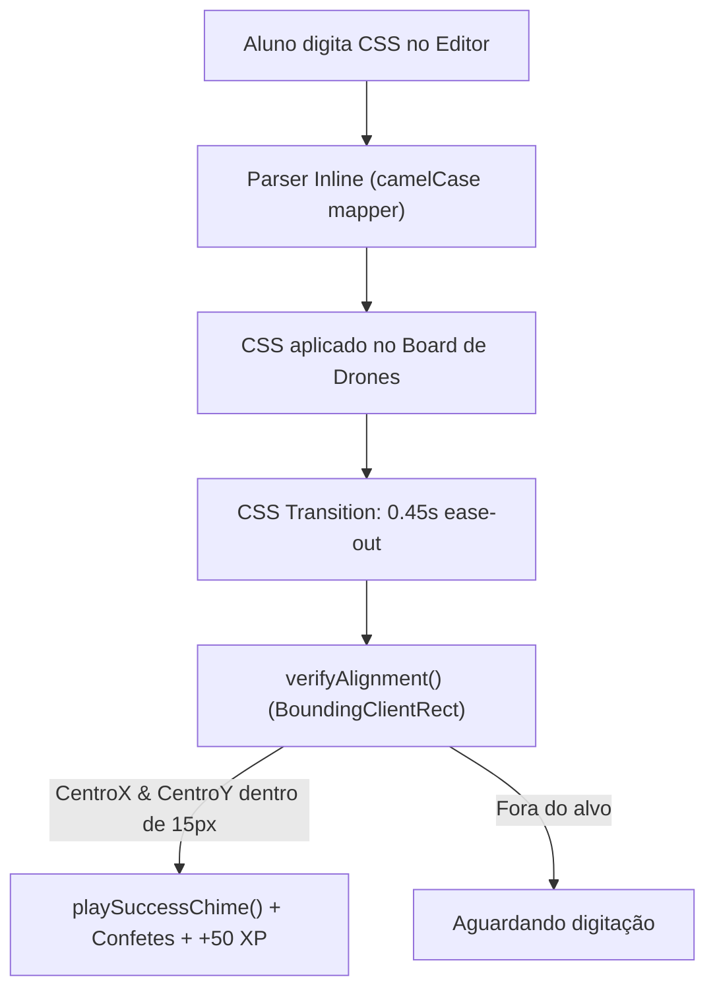

# 🎮 CSS Flex & Grid Arena (Minigame de Layouts)

> [!abstract] Aprendizado Visual Gamificado
> O **CSS Flex & Grid Arena** (`/css-arena`) é um minigame interativo inspirado em clássicos como *Flexbox Froggy* e *Grid Garden*. O aluno pilota naves espaciais e drones de reconhecimento, utilizando propriedades reais de CSS para encaixar os propulsores em portais de energia neon com validação em tempo real.

---

## 🗺️ Estrutura Curricular das 15 Fases

### Fase 1: Flexbox Propulsion (Níveis 1 a 10)
1. **Propulsão ao Fim da Linha**: `justify-content: flex-end;`
2. **Centralização Orbital**: `justify-content: center;`
3. **Distribuição Simétrica de Energia**: `justify-content: space-around;`
4. **Estabilizadores nas Extremidades**: `justify-content: space-between;`
5. **Pouso no Eixo Transversal**: `align-items: flex-end;`
6. **O Alinhamento Perfeito**: `justify-content: center; align-items: center;`
7. **Inversão de Marcha (Row-Reverse)**: `flex-direction: row-reverse; justify-content: flex-end;`
8. **Formação em Coluna**: `flex-direction: column; justify-content: space-between;`
9. **Espaçamento Magnético (Gap)**: `justify-content: center; gap: 32px;`
10. **Quebra em Múltiplas Linhas (Flex-Wrap)**: `flex-wrap: wrap; justify-content: space-between;`

### Fase 2: CSS Grid Matrix (Níveis 11 a 15)
11. **Matriz de 3 Colunas Fracionadas**: `grid-template-columns: repeat(3, 1fr);`
12. **Grade com Laterais Fixas**: `grid-template-columns: 100px 1fr;`
13. **Matriz 2x2 com Espaçamento Duplo**: `grid-template-columns: repeat(2, 1fr); gap: 20px;`
14. **Centralização Bidirecional**: `place-items: center;`
15. **Painel de Comando Avançado**: `grid-template-columns: repeat(3, 1fr); grid-template-rows: repeat(2, 80px); gap: 12px;`

---

## 🔬 Mecanismo de Validação em Tempo Real



### Validação Geométrica Defensiva (`CssArenaWorkspace.tsx`)
A validação calcula o centroide de cada drone e de cada portal alvo:
```typescript
const droneRect = droneEl.getBoundingClientRect();
const targetRect = targetEl.getBoundingClientRect();

const diffX = Math.abs((droneRect.left + droneRect.width/2) - (targetRect.left + targetRect.width/2));
const diffY = Math.abs((droneRect.top + droneRect.height/2) - (targetRect.top + targetRect.height/2));

if (diffX > tolerancePx || diffY > tolerancePx) {
  allMatched = false;
}
```
Isso garante que o usuário seja premiado pela posição física resultante, permitindo soluções criativas e tolerância suave entre navegadores.

---

## 🔗 Links Relacionados
* [[00 - MOC/00 - Mapa do Segundo Cérebro|Mapa Central do Segundo Cérebro]]
* [[03.1 - Enciclopédia DevDocs & W3Schools (Cheatsheets)|CheatSheets CSS]]
* [[03.4 - Arena de Desafios & Code Runner|Arena de Desafios]]
* [[03.26 - Theme Studio & Sistema Multi-Tema Neon|Theme Studio]]
