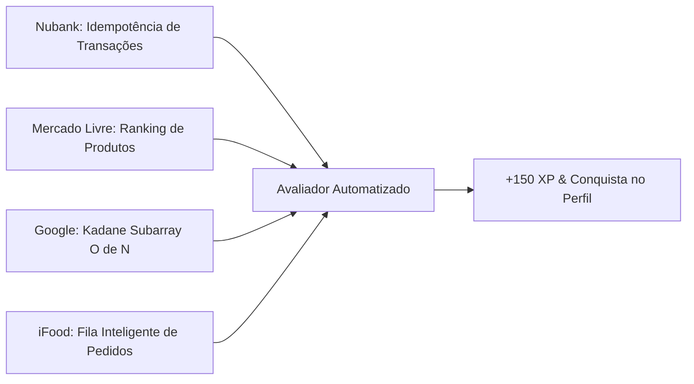

# 💼 Simulador de Entrevistas Técnicas (Interviews)

> [!abstract] Preparação Realista para Vagas de Tecnologia
> Disponível na rota `/interviews`, o simulador replica a tensão e as regras de uma entrevista técnica ao vivo com cronômetro regressivo, metas de complexidade Big-O e casos de teste ocultos (*hidden edge cases*).

---

## 🏢 Desafios de Empresas Reais

### 1. 🟣 Nubank: Processador com Idempotência
* **Cenário**: Transações financeiras não podem ser processadas duas vezes por conta de falhas e re-tentativas de rede.
* **Habilidades**: Hash Sets, validação de saldo e tempo linear $O(n)$.

### 2. 🟡 Mercado Livre: Ranking de Produtos por Relevância
* **Cenário**: Cálculo do score de catálogo ponderado por vendas e avaliação com agregação por categoria.
* **Habilidades**: Dicionários, agrupamento dinâmico e ordenação $O(n \log n)$.

### 3. 🔴 Google: Subarray de Soma Máxima (Kadane)
* **Cenário**: Encontrar o maior somatório contíguo em um array que contém números negativos e positivos.
* **Habilidades**: Programação dinâmica com otimização estrita para $O(n)$ de tempo e $O(1)$ de memória.

### 4. 🔴 iFood: Fila de Pedidos Prioritários (VIP + Espera)
* **Cenário**: Despacho de entregas priorizando clientes Clube iFood e maior tempo em fila.
* **Habilidades**: Enfileiramento, comparadores customizados e estruturas de fila.

---

## ⏱️ Funcionalidades da Sala de Entrevista
* **Cronômetro Ativo**: 25 a 45 minutos dependendo da senioridade (Júnior, Pleno, Sênior).
* **Casos de Teste Ocultos**: O código só é aprovado se passar em casos de borda que o candidato não consegue ver de antemão (ex: números negativos, arrays vazios, duplicatas consecutivas).
* **Recompensa**: +150 XP diretos no [[03.5 - Ranking Global & Ligas de XP (Leaderboard)|Ranking Global]].

---

## 🔗 Links Relacionados
* [[00 - Mapa do Segundo Cérebro|Voltar ao Mapa Central]]
* [[03.2 - Sandbox Interativo de Pilha (Stack LIFO)]]
* [[03.4 - Arena de Desafios & Code Runner]]
* [[03.5 - Ranking Global & Ligas de XP (Leaderboard)]]
