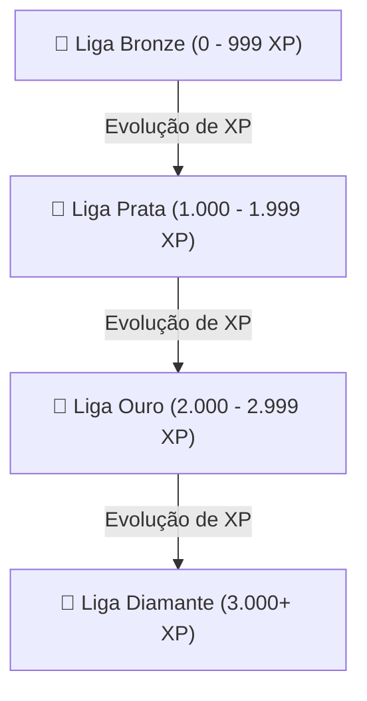

# 🏆 Ranking Global & Ligas de XP (Leaderboard)

> [!abstract] Mecânica Competitiva & Retenção
> O `/leaderboard` reúne a classificação semanal dos desenvolvedores, dividindo a comunidade em ligas de prestígio conforme a pontuação acumulada.

---

## 🛡️ As 4 Ligas de Desenvolvedores

| Liga | Faixa de XP | Visual | Descrição |
| :--- | :--- | :--- | :--- |
| **Diamante** | 3.000+ XP | Cyan & Violeta Radiante | Top 5% dos desenvolvedores com consistência e domínio algorítmico. |
| **Ouro** | 2.000 a 2.999 XP | Dourado | Desenvolvedores avançados com múltiplos projetos e desafios concluídos. |
| **Prata** | 1.000 a 1.999 XP | Prateado | Nível intermediário com rotina de estudos ativa. |
| **Bronze** | 0 a 999 XP | Bronze Terroso | Início da jornada no DevQuest. |

---

## 🔥 Sistema de Ofensiva Diária (*Streaks*)
* Cada dia em que o usuário resolve pelo menos 1 desafio ou avança em uma trilha, o contador de chamas 🔥 é incrementado.
* Usuários com maior sequência ganham posições de destaque na tabela.

---

## 🔗 Links Relacionados
* [[00 - Mapa do Segundo Cérebro|Voltar ao Mapa Central]]
* [[03.3 - Simulador de Entrevistas Técnicas (Interviews)]]
* [[03.4 - Arena de Desafios & Code Runner]]
* [[03.6 - Gerador de Certificados Verificáveis]]
