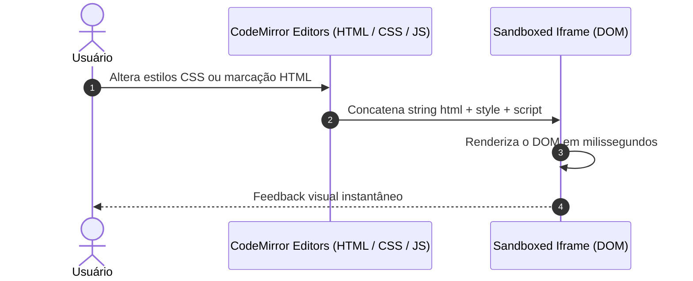

# 🛝 Web Playground & Iframe Sandbox

> [!abstract] Ambiente Frontend Completo no Navegador
> Disponível na rota `/playground`, o Web Playground oferece um ambiente de desenvolvimento triplo (HTML, CSS e JavaScript) com CodeMirror 6 e visualização ao vivo através de um iframe isolado com `sandbox="allow-scripts"`.

---

## ⚙️ Arquitetura do Preview em Iframe

---

## 🔗 Links Relacionados
* [[00 - Mapa do Segundo Cérebro|Voltar ao Mapa Central]]
* [[03.1 - Enciclopédia DevDocs & W3Schools (Cheatsheets)]]
* [[04.2 - Projetos Práticos Guiados]]
