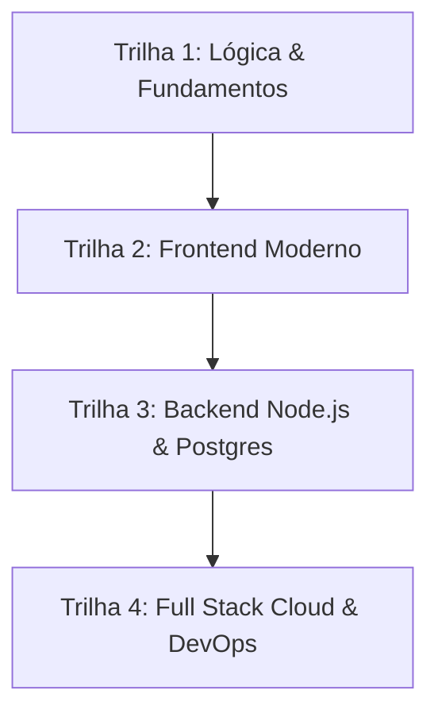

# 🧭 Trilhas de Aprendizado

> [!abstract] Formação Estruturada do Zero ao Profissional
> As trilhas (`/tracks/[slug]`) organizam o conteúdo em sequências pedagógicas lógicas, unindo conceitos teóricos, exercícios na arena e projetos práticos.

---

## 🗺️ As 4 Trilhas Oficiais

### 1. 🟢 Lógica & Fundamentos (`logica-e-fundamentos`)
* Tipos primitivos, controle de fluxo (`if/else`, `loops`), arrays, matrizes, funções e introdução a Big-O.
* Exercícios: Manipulação de strings, ordenação básica e pilhas fundamentais.

### 2. 🔵 Frontend Moderno (`frontend-moderno`)
* HTML Semântico, CSS Flexbox & Grid, JavaScript ES6+, React 19, Hooks customizados e Next.js App Router.
* Projeto: Calculadora Neumórfica e Dashboards responsivos.

### 3. 🟣 Backend Node.js & Postgres (`backend-nodejs-postgres`)
* APIs RESTful, HTTP status codes, PostgreSQL relacional, ORMs (Drizzle/Prisma), autenticação JWT e regras de negócio.
* Projeto: Processador de pagamentos e transações com idempotência.

### 4. 🔴 Full Stack Cloud & DevOps (`fullstack-cloud-dev`)
* Deploy na Vercel/Render, Neon Database Serverless, Docker, CI/CD com GitHub Actions e testes automatizados (Vitest & Playwright).
* Projeto: Aplicação completa SaaS de ponta a ponta.

---

## 🔗 Links Relacionados
* [[00 - Mapa do Segundo Cérebro|Voltar ao Mapa Central]]
* [[03.4 - Arena de Desafios & Code Runner]]
* [[04.2 - Projetos Práticos Guiados]]
* [[03.6 - Gerador de Certificados Verificáveis]]
