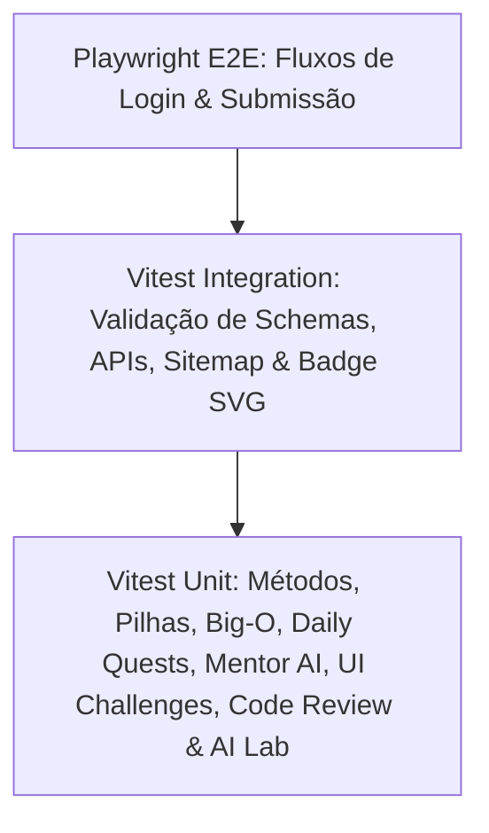

# 🧪 Estratégia de Testes Automatizados (Vitest & Playwright)

> [!abstract] Qualidade & Zero Regressões
> O DevQuest possui uma bateria de testes contínua composta por **79 testes automatizados** distribuídos em 21 arquivos de suíte executados pelo **Vitest**, garantindo que algoritmos, regras de negócio, dados e esquemas permaneçam 100% íntegros a cada commit.

---

## 🔬 Divisão da Pirâmide de Testes



### 1. Testes Unitários de Métodos & Estruturas (`src/__tests__/cheatsheets.test.ts`)
* Validação da consistência do dataset DevDocs (nomes, sintaxe, parâmetros, flags de mutabilidade).
* Execução e asserção da lógica de Pilha (LIFO: `push`, `pop`, `peek`, `size`, `isEmpty`).
* Teste do algoritmo clássico de parênteses válidos com pilha.

### 2. Testes de Entrevistas Técnicas (`src/__tests__/interviews.test.ts`)
* Execução dos algoritmos de solução de cada desafio de Big Tech (Nubank, Mercado Livre, Google, iFood).
* Verificação de que o starter code e a solução atendem às metas de Big-O e passam nos casos de teste.

### 3. Testes de Desafio Diário & Heatmap (`src/__tests__/daily.test.ts`)
* Rotação determinística do desafio diário conforme o dia do ano.
* Geração do histórico de atividade anual de 150+ dias com níveis de intensidade válidos.

### 4. Testes do Mentor DevBot AI (`src/__tests__/mentor.test.ts`)
* Detecção heurística de complexidade quadrática $O(n^2)$ e loops aninhados.
* Diagnóstico de retornos ausentes e geração de questionamentos socráticos.

### 5. Testes de Desafios Visuais UI/UX (`src/__tests__/ui-challenges.test.ts`)
* Catálogo de desafios de fidelidade visual (Cartão Glassmorphic, Pricing Switcher).
* Validação de marcação HTML e CSS de referência.

### 6. Testes de Code Review com IA (`src/__tests__/code-review.test.ts`)
* Detecção mandatória de SQL Injection com emissão de status `CHANGES_REQUESTED`.
* Diagnóstico de vazamento de memória (*Memory Leak*) em hooks React sem cleanup.
* Cálculo ponderado de métricas de Segurança (OWASP), Manutenibilidade e Desempenho.

### 7. Testes do Laboratório de Agentes de IA (`src/__tests__/ai-lab.test.ts`)
* Validação de parâmetros obrigatórios nos JSON Schemas das ferramentas.
* Execução sequencial completa do ciclo ReAct (Thought ➔ Action ➔ Observation ➔ Final Answer).

### 8. Testes de SEO, Sitemap & Badge SVG (`src/__tests__/seo-badge.test.ts`)
* Geração dinâmica do sitemap contendo rotas estáticas, trilhas e projetos.
* Formatação do `robots.txt` e permissões de rastreamento.
* Renderização do card vetorial SVG da API de badges do GitHub com headers de cache.

### 9. Testes de Ranking, Ligas & Certificados (`src/__tests__/leaderboard.test.ts`, `certificate.test.ts`)
* Garantia de faixas de XP, ordenação do pódio e links de compartilhamento do LinkedIn.

---

## 🚀 Como Executar os Testes
```bash
# Execução única de todos os testes
npm test

# Modo assistido com hot-reload a cada alteração
npm run test:watch

# Testes de ponta a ponta com navegador real
npm run test:e2e
```

---

## 🔗 Links Relacionados
* [[00 - Mapa do Segundo Cérebro|Voltar ao Mapa Central]]
* [[01.2 - Arquitetura de Software & Next.js 16]]
* [[05.3 - Guia de Comandos & Scripts NPM]]
