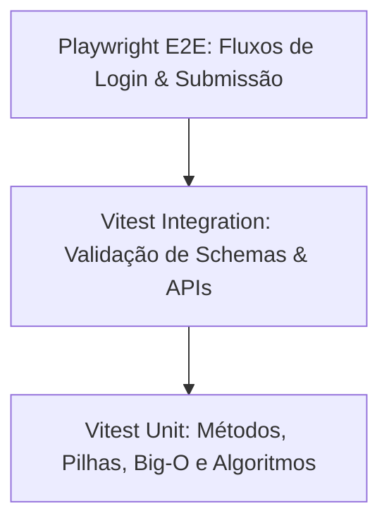

# 🧪 Estratégia de Testes Automatizados (Vitest & Playwright)

> [!abstract] Qualidade & Zero Regressões
> O DevQuest possui uma bateria de testes contínua composta por **59 testes automatizados** distribuídos em 15 arquivos de suíte executados pelo **Vitest**, garantindo que algoritmos, regras de negócio, dados e esquemas permaneçam 100% íntegros a cada commit.

---

## 🔬 Divisão da Pirâmide de Testes



### 1. Testes Unitários de Métodos & Estruturas (`src/__tests__/cheatsheets.test.ts`)
* Validação da consistência do dataset DevDocs (nomes, sintaxe, parâmetros, flags de mutabilidade).
* Execução e asserção da lógica de Pilha (LIFO: `push`, `pop`, `peek`, `size`, `isEmpty`).
* Teste do algoritmo clássico de parênteses válidos com pilha.

### 2. Testes de Entrevistas Técnicas (`src/__tests__/interviews.test.ts`)
* Execução dos algoritmos de solução de cada desafio de Big Tech (Nubank, Mercado Livre, Google, iFood).
* Verificação de que o starter code e a solução atendem às metas de Big-O e passam nos casos de teste.

### 3. Testes de Ranking & Ligas (`src/__tests__/leaderboard.test.ts`)
* Garantia de faixas de XP e ordenação correta do pódio.

### 4. Testes de Certificados (`src/__tests__/certificate.test.ts`)
* Validação de regex do código do certificado (`DQ-2026-NUBANK-9482`) e montagem do link oficial do LinkedIn.

---

## 🚀 Como Executar os Testes
```bash
# Execução única de todos os testes
npm test

# Modo assistido com hot-reload a cada alteração
npm run test:watch

# Testes de ponta a ponta com navegador real
npm run test:e2e
```

---

## 🔗 Links Relacionados
* [[00 - Mapa do Segundo Cérebro|Voltar ao Mapa Central]]
* [[01.2 - Arquitetura de Software & Next.js 16]]
* [[05.3 - Guia de Comandos & Scripts NPM]]
